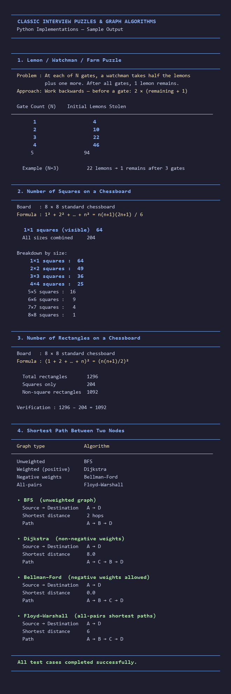

# Classic Puzzles & Graph Algorithms

Python implementations of classic interview puzzles and shortest-path algorithms.

## Files

| File | Description |
|------|-------------|
| `lemon_watchman.py` | Lemon/Watchman/Farm puzzle (work backwards) |
| `chessboard_squares.py` | Count squares on an N×N board |
| `chessboard_rectangles.py` | Count rectangles on an N×N board |
| `shortest_path.py` | BFS, Dijkstra, Bellman-Ford, Floyd-Warshall |
| `test_all.py` | Runs sample test cases for all modules |
| `generate_screenshot.py` | Generates the output screenshot for this README |

## Sample Output



## Run

```bash
python test_all.py
```

This prints the formatted output of every test case in the terminal.

To regenerate the screenshot after changes:

```bash
pip install pillow
python generate_screenshot.py
```
